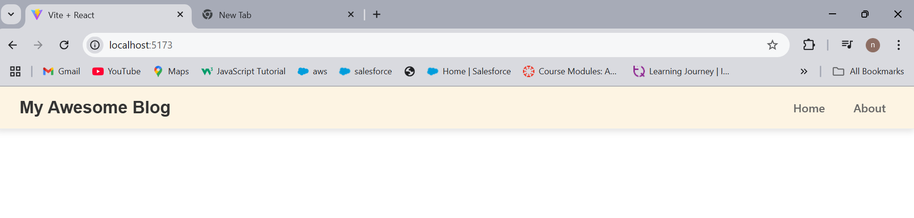

# My React Blog

A blog platform built with React and Vite.

## Setup Instructions
1. Clone the repository
2. Run `npm install`
3. Run `npm run dev`
4. Open http://localhost:5173 in your browser

## Project Structure
my-blog/
├── node_modules/       # Dependencies (don't modify)
├── public/             # Static files like images or icons
├── src/                # Your source code
│   ├── App.jsx         # Main application component, renders the UI
│   ├── main.jsx        # Application entry point, starts the app
│   ├── index.css       # Global styles for your application
│   └── components/     # Folder for reusable components like Header, Footer, etc.
│       └── Header.jsx  # Header component containing the blog's title and navigation
├── package.json        # Project configuration, includes dependencies and scripts
├── vite.config.js      # Vite configuration for the development build tool
├── .gitignore          # Specifies files and folders to be ignored by Git
└── README.md           # Project description and setup instructions

## Screenshot

## What I Learned
React components, vite Setup and Benefits and Version Control with Git